# DRL-Navigation-P1-Report
Project 1 Udacity's Deep RL nanodegree Report

##### &nbsp;

## Contents

1. Goal, State & Action Space.
2. Training a vanilla DQN.
3. Visualizing Results and Going Further: The problem of Instability/Loops
4. Learnable Discount Function
5. Time Awareness 
6. Possible Future Improvements and Directions

##### &nbsp;

## 1. Goal, State & Action Space

In this project, we train a reinforcement learning (RL) agent that navigates an environment similar to [Unity's Banana Collector environment](https://github.com/Unity-Technologies/ml-agents/blob/master/docs/Learning-Environment-Examples.md#banana-collector). The environment has yellow and blue bananas scattered around a in rectangle-shaped environment. Occasionally some bananas drop from the air. The environment is episodic and runs for 300 timesteps (30 seconds).

A reward of +1 is provided for collecting a yellow banana, and a reward of -1 is provided for collecting a blue banana. The goal is to collect as many yellow bananas as possible while avoiding blue bananas. The environment is solved when the agent achieves an average score of +13 over 100 consecutive episodes.

The state space has 37 dimensions and contains the agent's velocity, along with ray-based perception of objects around the agent's forward direction (check the detailed code [here](https://github.com/Unity-Technologies/ml-agents/blob/e82450ab8304093871fd19b876a0f819d390e79d/UnitySDK/Assets/ML-Agents/Examples/SharedAssets/Scripts/RayPerception.cs#L11)). Four discrete actions are available:

- `0` move forward
- `1` move backward
- `2` turn left
- `3` turn right 

##### &nbsp;

### 2. Training a vanilla DQN
We first train our agent using a vanilla `DQNetwork` with two fully connected layers of size 32. We note that all our methods in this project use a __Replay Buffer__ which provides the dataset and sampling for *experience replay*.  We solve the environment in 225 episodes, or 125, if following the practice of ignoring the first 100 episodes.

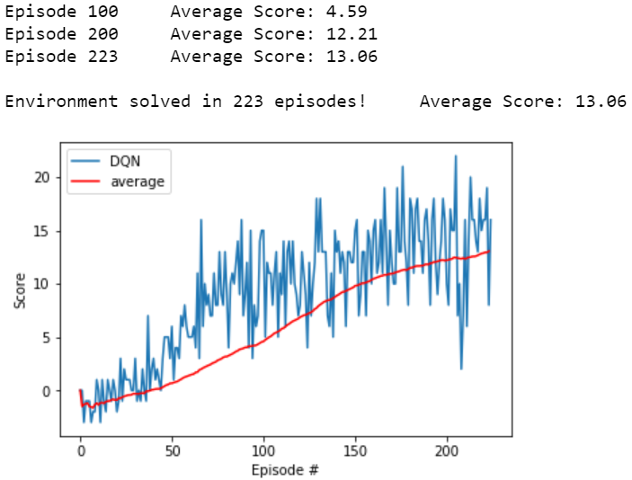

The hyperparameters can be found in `hyperparameters.py` but also given below.
```python
BUFFER_SIZE = int(1e5)  # replay buffer size
BATCH_SIZE = 500    # minibatch size
GAMMA = 0.99     # discount factor
TAU = 1e-3              # for soft update of target parameters
LR = 1e-4            # learning rate 
UPDATE_EVERY = 2  # how often (timesteps) to update the network
EPS_START = 0.9 
EPS_END = 0.01
EPS_DECAY = 0.98
SEED = 0   #initialization seed
```

##### &nbsp;

### 3. Visualizing Results and Going Further: The Problem of Instability/Loops
We train the agents and observe its behavior in many episodes. [Here](https://www.youtube.com/watch?v=LMPpxnLnSVU) is an example of a normal run where the agent attains score 22!

We find out that although the agent has technically solved the environment, there is instability in the results; a typical problem of DRL agents which results in their unreliability and is an obstacle to practical implementation, see [here](https://www.alexirpan.com/2018/02/14/rl-hard.html) for a long post on the problems of deep RL, esp. the section on **The Final Results Can be Unstable and Hard to Reproduce**. The significant drops (sometimes to *zero*) happens when the agent gets stuck in a sort of a loop of actions. [Here](https://www.youtube.com/watch?v=vLlwUaTGAEc) are many examples of different interesting behavior, with description below:  
  1. Two *normal* loops with seen image being a yellow and a blue banana or both blue bananas; there is usually more fuzziness in the agent's movement if it encircled by blue bananas, or the yellow bananas are all far away.
  2. A back and forth movement loop.
  3. A loop right at the start causing zero score.
  4. A situation where rewards seems to be far off but the agent manages to get to yellow bananas without getting stuck in a loop.
  5. An *inefficient* movement of the agent where it scrubs the wall to move and ultimately heads for the yellow banana in its sight.
  6. An (interesting) **long** loop!
  
We would like to count how many times we get stuck in such loops. It is not easy to *exactly* evaluate the number of loops. When the agent gets stuck in a loop, especially if it is with a *short* period which is mostly the case, it is seeing the exact same states many times (the seen part of the environment is very unlikely to change). Hence we could count if any state has happened for more than `counter_states` time in an episode. If this happens, we count that as a loop. In fact, this is the very mechanism used further below to detect the episodes with loops as we recorded 2 hours of agent's play. We see that in 200 episodes we have a lot of loops! The 9906 number below is calculated based on how many times the agent saw a state seen more than three times before (`counter_states=3`). Therefore when we see a huge uptick, it is because the agent got completely stuck in a loop until the end of the episode. The episodes at which there are close to 300 are those episodes where the loop starts right at the beginning and we can see the score is zero. We can definitely see a nice overall correspondence between the uptick and lowtick in the loop and score count, respectively. 

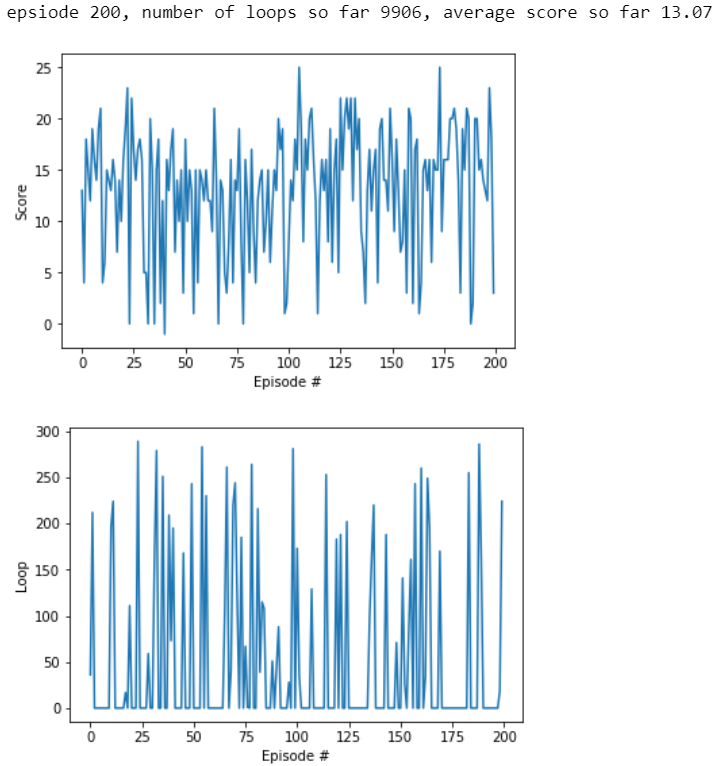

This could partially go to the deep problem of exploration/exploitation dilemma or simply to the problem of the lack of training, as 225 episodes may not have been enough yet to adequately update the action value across the environment space. So we first train further for a couple of hundred more episodes to reach average score 16.5. Watching that agent play, reveals far fewer loops in 200 episodes. Notice that some drops in the score could also be due to the sparsity of the yellow bananas in that particular episode.

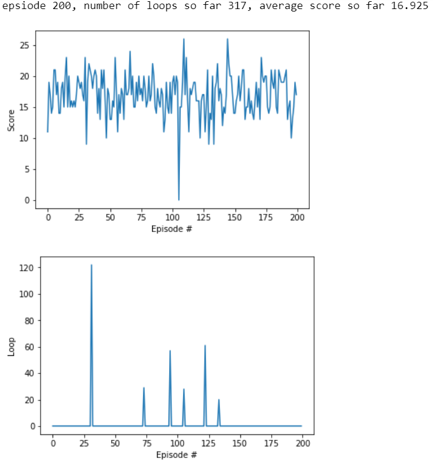

Still we can see loops happening sometimes but they are far more *complicated*. We see a zero score which should correspond to getting stuck in a loop right at the beginning but our loop count does not associate a high number to it. It may have been a loop with a long period. We tried to implement also a `loop_breaker` mechanism where we simply make the agent choose a random action with probability 0.99 if it has observed same state more than `counter_states=3`. It has varying degree of success as shown in examples [here](https://www.youtube.com/watch?v=4OpkVXkjPUA):
  - The agent falls into a loop right at the start, but its loop is quite complicated as the `loop_break` mechanism only detects two separate counts of loop in this instance and fails to get the agent out of the loop.
  - The agent gets out of the one recognized loop successfully and achieves a score of 7.
  - The agent achieves a score lower than five with four counts of loops during the episode and `loop_breaker` fails in this instance as well.
  
##### &nbsp;

### 4. Learnable Discount Function

In the following two sections, we will discuss strategies that are _conjectured_ to improve a DQN performance. As we are only analyzing one rather simple game here, and the episode length is rather small (300 seconds), the vanilla `DQNetwork` does a similar job as the other more sophisticated implementations below. Therefore, consider this next two sections as ideas that could provide improvements in more complicated environments.

Perhaps the most fundamental parameter in the basic RL framework which regulates the behavior of the agent is the discount factor `gamma`; ranging from 0 to 1, it provides a certain *spectrum* of possible strategies. The question is, given the current problem, what is the best discount factor, for which the derived optimal policy would really be achieving the ultimate goal: Maximizing the **total** rewards in 300 timesteps. Imagine a course of action in which we collect 10 bananas in the first ten timesteps and another in which we collect 11 bananas in the last 11 timesteps.

As mentioned the **total** rewards (_undiscounted_) is our *criteria*. Hence, obviously the latter is the better course of action but an exponential weighting lesser than 1 like `gamma=0.999` gives a higher score to the _former_ course of actions. Therefore, a policy optimized with `gamma=1` is generally better than any other policy coming from a discount factor less than 1. 

It should be noted that in our case where we only have 300 timesteps, we *can* implement `gamma=1` and we will get similar results. But as mentioned at the beginning of this section, these are ideas that are conjectured to generally improve a DQN performance for more complicated tasks.

It is easy to see (as also seen in real life examples) that coming up with a short-term reward based strategy is much easier than a long-term reward based strategy, and this is related to the fact that the Q-value function to be approximated for short-term strategies (small values of `gamma`) is much simpler than the other. Hence, the DQN can succeed to find short-term strategies relatively fast, but obviously, we have to strive to put `gamma` as closest to one as possible to get the *best* policy. DQN sometimes succeeds but mostly doesn't do better if `gamma` is *too* close to one or is set exactly at one; training may become harder as it is trying to really look *far* ahead and approximate a more complicated Q-function. That is why we see a lot of models in the literature trained with `gamma` close to one even though the argument above still applies: Theoretically, the best strategy is the one coming from `gamma=1`.

How can we do better on this issue? One idea is to use the fact that DQN can do well on smaller than 1 discount factor. In fact, it may be better sometimes to follow the action provided by a smaller `gamma` like `0.9` than the one provided with `0.99`. The reason is that the action provided by `0.99` may not be the actual best action as the DQN may not have accurately estimated its reward. But it has a higher probability to have accurately approximated the reward for the action from `gamma=0.9`, as it is coming from a more short-term reward based optimal strategy and therefore easier to approximate. 

Hence, the idea is to apply the Multi-Horizon network detailed in [here](https://arxiv.org/abs/1902.06865) (see p.11, or box 3 and 4 below):

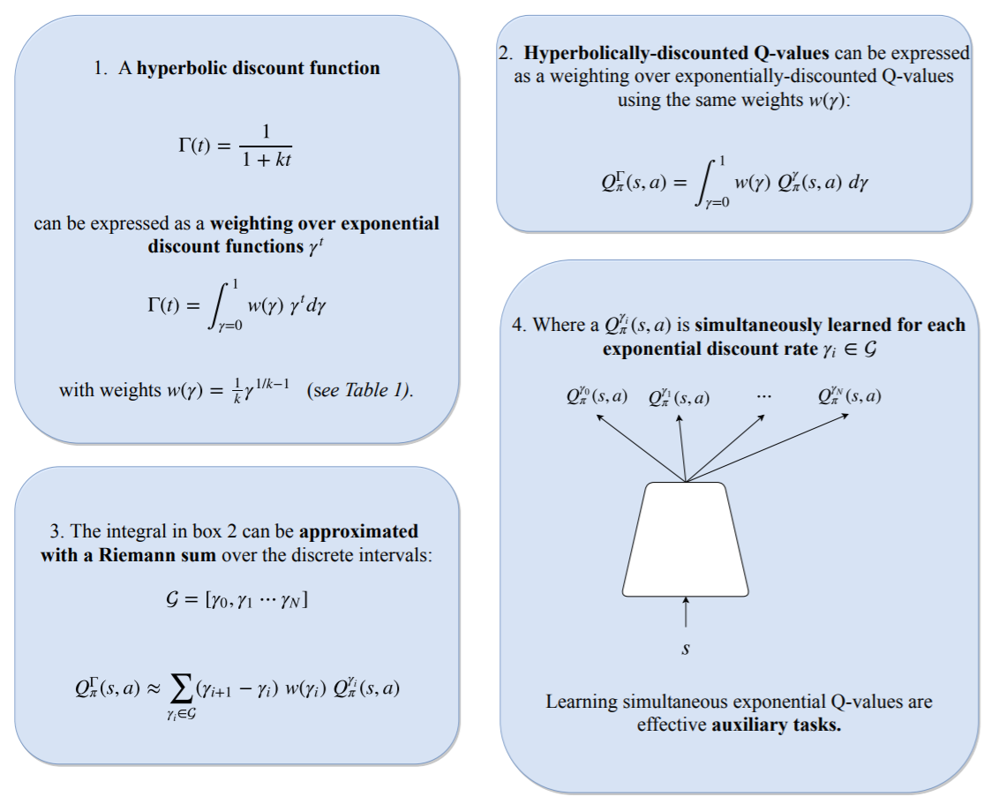

In our implementation (`DQN.py`), `MHQNetwork` computes the Q-function for multiple values of `gamma`, but instead of choosing a fixed (*hyperbolic*) weighting as done by the authors in that paper, we let the `DFQNetwork` *learn* the best weighting. The loss function for `DFQNetwork` is given assuming it is trying to find a linear combination which gives optimal strategy for `gamma=1` (which was our primary goal).

The weights of `DFQNetwork` have another nice interpretation: They give a *learned* discount **function**, call it `Gamma(t)` (dependent on timestep `t`), which is not necessarily exponential. This can be thought of as a preferred discount function for the DQN with which it *can* be trained and get close to the theoretical optimal policy provided by `gamma=1`. The analysis behind this claim can be found in `DFQNetwork_and_Learned_Discount_Function.pdf`, which shows why `DFQNetwork` weights can be interpreted as the learned discount function and how `Gamma[t]` can be implemented via the following code:

```python
Gamma=np.array([(agent.dfqnetwork_local.linear[0].weight * (agent.discounts**i)).sum() for i in range(300)])
fig = plt.figure()
ax = fig.add_subplot(111)
plt.plot(np.arange(len(Gamma)), Gamma)
plt.ylabel('Gamma')
plt.xlabel('Steps #')
plt.show()
```

Getting to implementation, our agent solves the environment in 241 episodes (or 141) with the same hyperparameters as vanilla `DQNetwork`, and can be trained in 482 episodes to score 16.

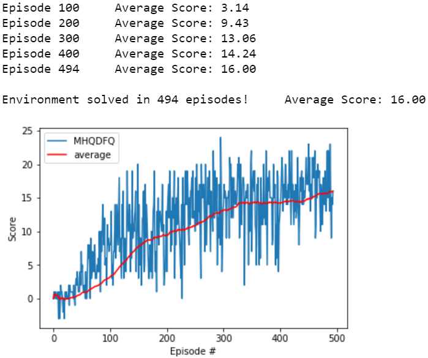

Further, we can watch either any of the horizons playing or their linear combination. We play some of the high (0.99), middle (0.94) and low (0.9) `gamma` values and their linear `DFQNetwork` combination (the plots are given below in order). They seem to achieve different average results on a 100 episode run. Smaller values of `gamma` tend to achieve lower results as it is expected from a strategy based more on short-term rewards.

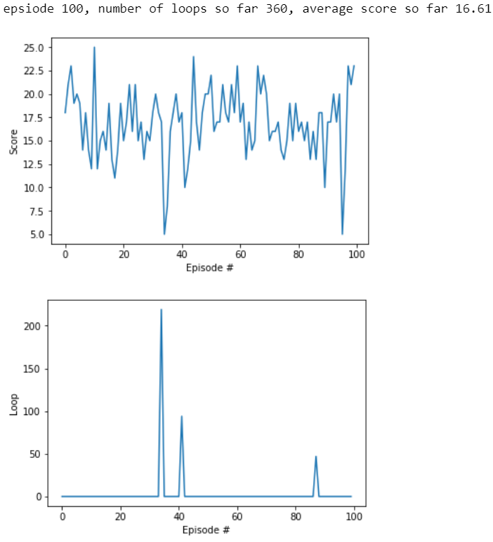
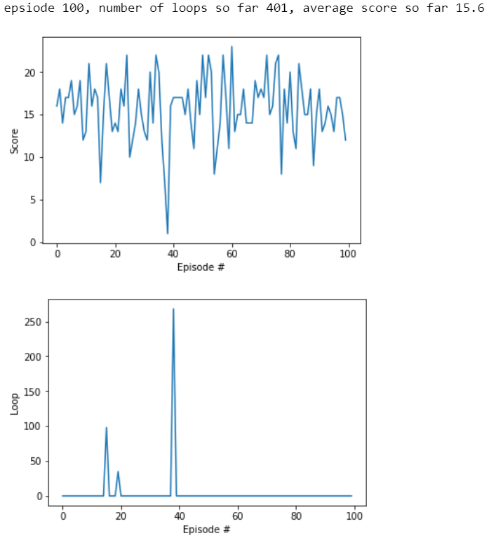
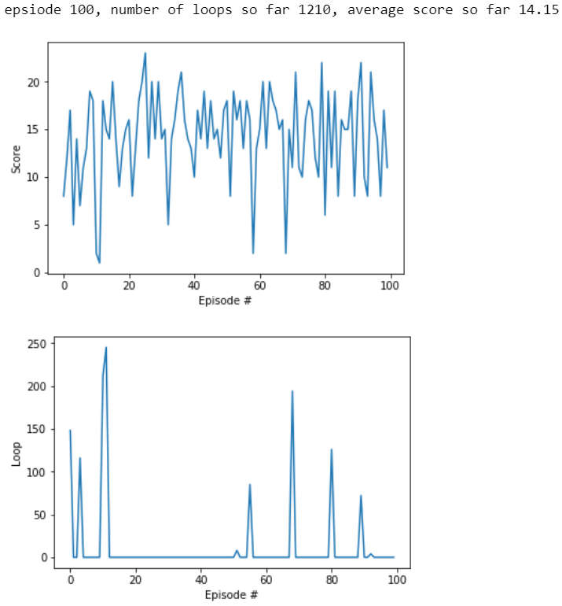


As for the `Gamma(t)` function at score 16, here is the plot:


We see quite an uptick in the first 4 seconds where `Gamma(t)` goes even higher than 1.2! This means the agent has become quite certain about the next 4 seconds rewards as the multi horizons have been able to provide the agent an accurate prediction of the total reward for the next 4 seconds. But ultimately the weighting decreases faster and moves asymptotically to almost 80% of the exponential weighting as shown below. This shows the agent has a lot of *mistrust* in the multihorizons predictions on whether it can get rewards on those long timescales.

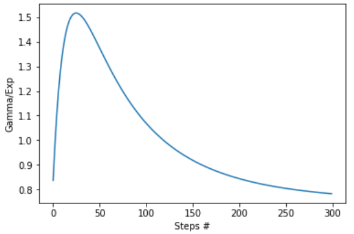
 
##### &nbsp;

### 5. Time Awareness 

Although it may seem that our problem is an instance of completely observable environments, we have one crucial aspect of the environment missing in the `state` given by `env`: the remaining time of the episode. It is not hard to imagine how this could influence the optimal behavior. To solve this issue, we can add the time remaining to the state. The idea was proposed in [here](https://arxiv.org/abs/1712.00378). Combining this with the multihorizon could lead to a time aware agent which is trying to maximize the total reward, a combination which is needed as maximizing total reward *without an observation of the time* may not actually be optimal in an episodic task (esp. with a fixed time constraint). Using a `time_step` (normalized) counter, we can give this information to the agent. We solve the environment in 343 episodes.

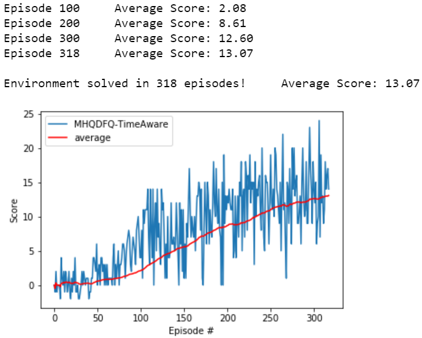

##### &nbsp;

### 6. Possible Future Improvements and Directions

1. One can imagine an action dependent learnable discount function. The same analysis as in `DFQNetwork_and_Learned_Discount_Function.pdf` applies, where in the equations one has to only replace `omega(gamma)` by `omega(gamma,a)`, and we only need to change the `DFQNetwork` to have a separate linear layer for each action. This broadens the scope of strategies the agent can achieve.

2. What would happen if the `DFQNetwork` was deep? It is not clear what the meaning of this would be! The analysis in above does not apply (as far as we can see), meaning that nonlinear combination of multihorizon is not associated to a more complicated discount function. Still, it is of theoretical interest to be investigated. Another interpretation of what has been done above and could be done with multilayer `DFQNetwork` is that we are doing a certain kind of *hierarchical RL* by combining multihorizons strategies in a linear fashion, which perhaps can be extended to nonlinear. Here, we train a one hidden layer version of `DFQNetwork`:
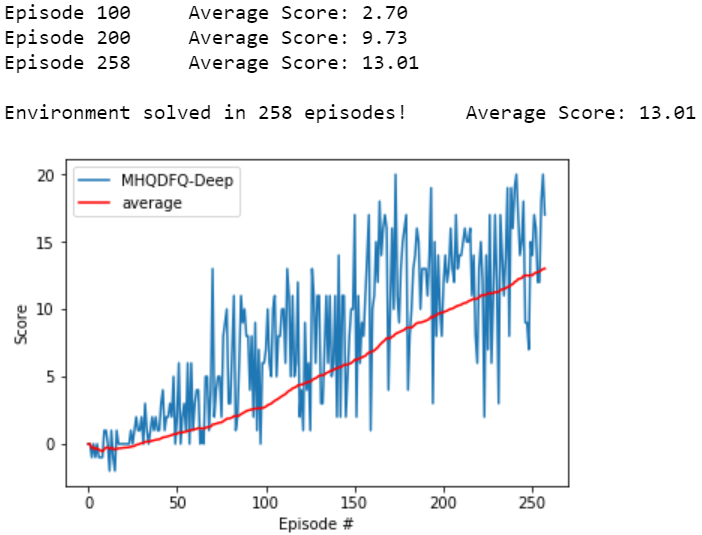

3. The learnable discount function could accomplish better results on more complicated games. For a start, we should apply the technique on the same games tested in the hyperbolic discount function paper (see p.28 [here](https://arxiv.org/abs/1902.06865)) to see if we obtain improvements on their results.

4. Vanilla `DQNetwork` seems to be doing a good job, trains in fewer episodes and also trains faster (in real-time) than other models due to its simplicity. But it could be improved using the variety of improvements all implemented in Rainbow DQN such as:
    - [Prioritized Replay](https://arxiv.org/abs/1511.05952): To learn from important experience that may get lost as the memory is finite, we add `|delta_t|` (the absolute value of TD error at timestep `t`) to the `SARS` tuple and order by `|delta_t|` the probability of their selection. To avoid zero division, we need to add a decay term `eps_decay` to all `|delta_t|`. We can also move along a spectrum of uniform-prioritized sampling by introducing a hyperparameter `0 <= a <= 1` and taking the probability to come from `p_t**a=(|delta_t|+eps_decay)**a`, i.e. `P(t)=p_t**a / sum_t p_t**a`. When `a=1`, this is the pure prioritized sampling and when `a=0` it is the usual uniform sampling. Finally, as our distribution is no longer iid, we need to change the learning rule and multiply the learning rate by `(1/N * 1/P(t)) ** b` where `N` is the replay buffer size, and `b` goes from a low value to one.
    - [Dueling DQN](http://proceedings.mlr.press/v48/wangf16.pdf): We know that `Q(s,a)=V(s)+A(s,a)` where `V` is the state value function and `A` is the advantage function. The *state* value function by definition do not differ across actions. Therefore the idea is to estimate them as they are easier to estimate and then try to approximate the difference across actions which is the advantage function. The implementation is best summarized in the picture below. More details can be found in the paper. For example, we want to make sure that our estimation of `V,A` is such that `max_a Q(s,a) = V`. To ensure this *indentifiability* of `V`, it is better to use `A - max_a A` instead of just `A` in the last addition module below. An even better solution is to use `A- mean(A)` as it would force the advantage to only move as fast as the mean instead of compensating for maximum. Therefore, we would only need to evaluate the max in the advantage stream as it is the only of the two streams dependent on action and we can be confident enough that `max_a Q(s,a)` is really close to `V`. Further, it should be noted that in Dueling DQN, the Q-value is essentially updated for all actions as they share information in `V` and `mean(A)`, instead of just one action like in DQN. As the `action_size` grows, the outperformance of Dueling DQN also grows, as the advantage stream makes sure that noise cannot abruptly change the policy when scale of gap between `Q(s,a)`s for all `a`, is much smaller than the scale of `Q(s,a)` itself. 
    
    
    - [Double DQN](https://arxiv.org/abs/1509.06461): When it comes to picking the target, DQN picks the max of the target network Q-values. This could result in overestimation as we have not yet gathered enough information (esp. at the beginning of training). So instead, we could choose the best action according to our local DQN, and then evaluate the target DQN at that action. Hence we are using a different set of parameters (the local DQN) to select the action, from the set of parameters used to evaluate it (the target DQN). This results in stability and avoids the explosion of Q-values. A small change in the code where we select `next_action_values` in `agent` can be performed to apply this algorithm.
    
5. Using the above approaches, we could try to beat the record of vanilla `DQNetwork` in solving the environment in as few episodes as possible, but also, try to reach the highest possible score; we only went up to score 16 as the agents were beginning to show signs of destabilization.
